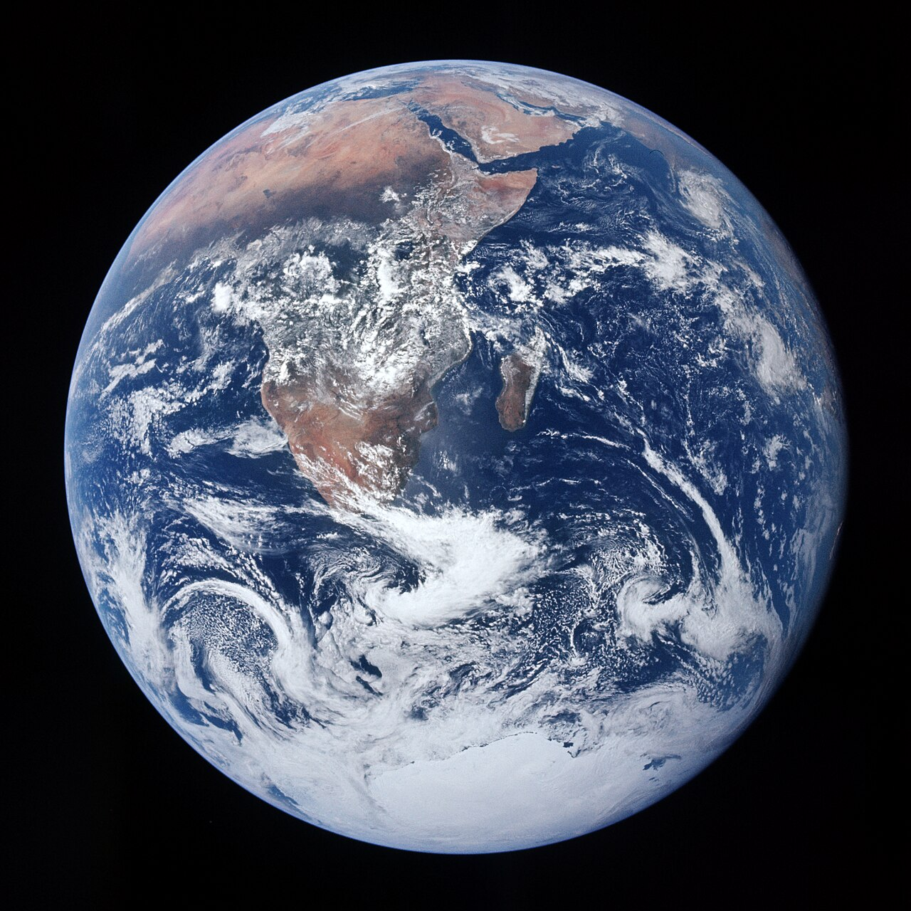
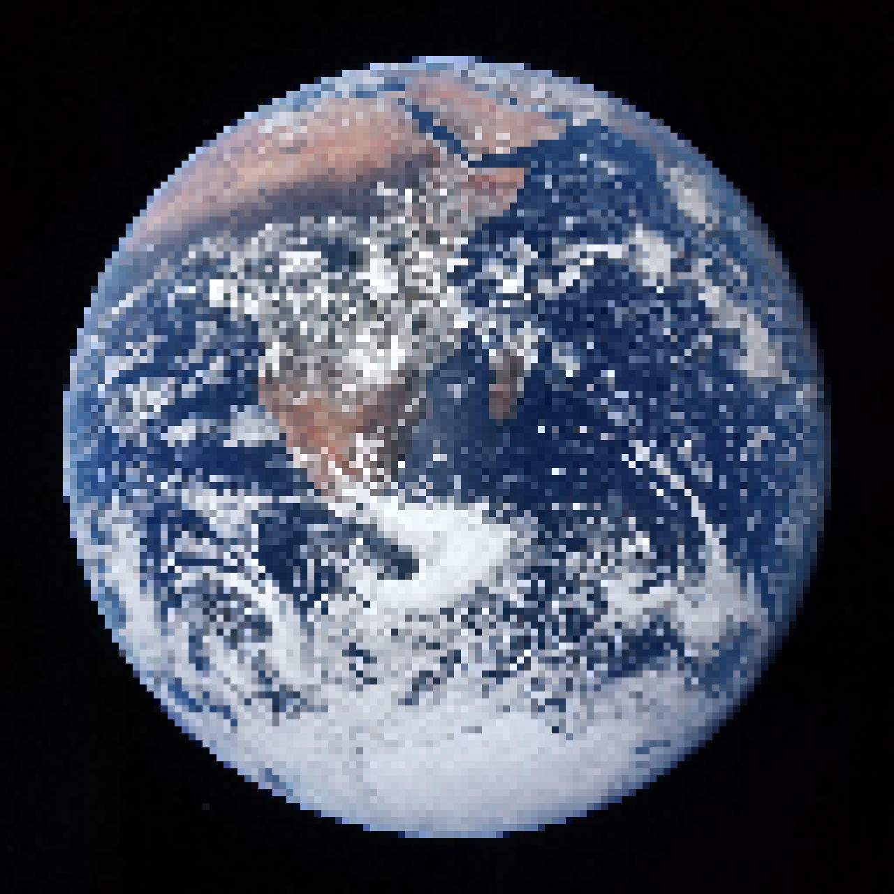
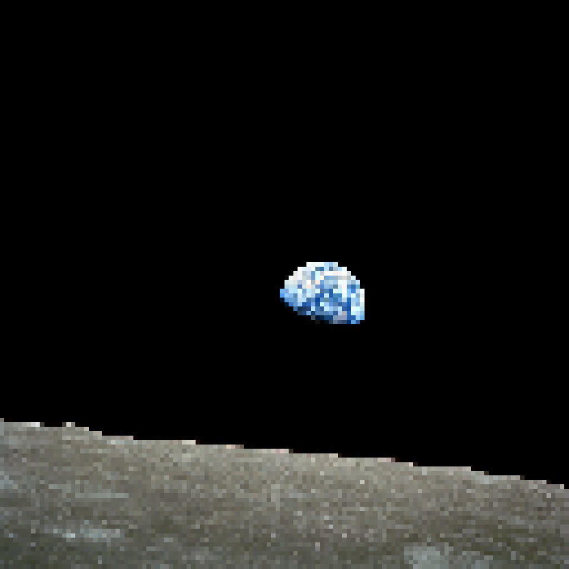
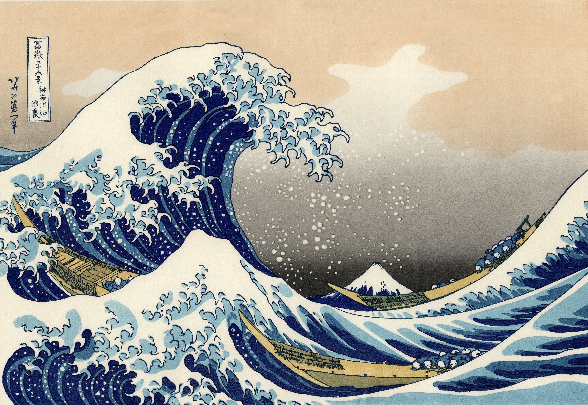
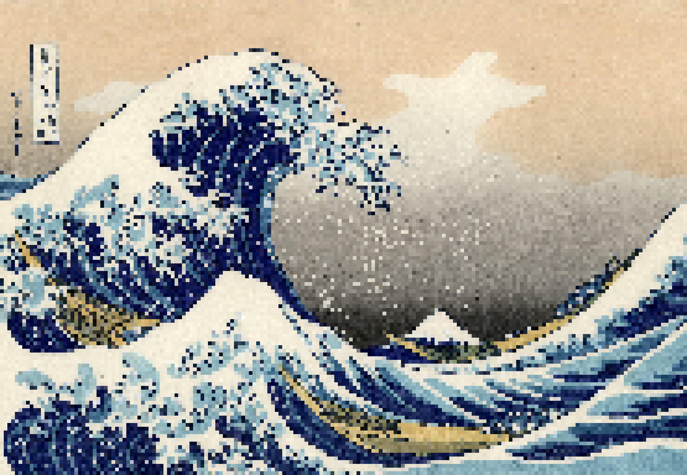

# Pixel Art Conversion Tool

Convert any image to a 8-bit retro style image commonly referred to as [pixel art](https://www.reddit.com/r/PixelArt/).

This particular tool provides more autonomy to the user, allowing them to choose various 
downscaling ratios, quantization levels or color palettes to alter the level of detail and color they want to retain in the image.

This project stems from my obsession with Pixel Art, which is now on every wallpaper on my laptop,
including [this funny one](https://www.reddit.com/r/PixelArt/comments/iaz61i/its_all_pixels/#lightbox) as my main Desktop background. This project is still in its infancy as
I tackle the realms of the [pixel art forums](https://pixeljoint.com/forum/forum_posts.asp?TID=11299) to better my craft.

But this comes with a disclaimer that I am not an artist and I appreciate all the hardworking artists
who make awesome pixel art for everyone. Please support the artists alongside this project.

## Installation and Usage

There is no binary release yet as of version `0.1.0`. You must install and use it like any developer.

```shell
git clone "https://github.com/aritrabiswas2004/pixel-art-generator"
```

and then 

```shell
make build
```

and alternatively you can run directly which would start the CLI tool

```shell
cargo run -- ./path/to/image.jpg
```

## Examples

This part is to track progress as more complex images need refinement over how pixel art
is created. 

All these images are processed at a downscaled height of 128 pixels before being upscaled
to its original dimension. This can be changed though, as per the user's requirements.

| Original                                                                                           | Processed                                  |
|----------------------------------------------------------------------------------------------------|--------------------------------------------|
|  Harrison Schmitt, "The Blue Marble", Apollo 17, NASA          |   |
|  William Anders, "Earthrise", Apollo 8, NASA             |    |
|  Katsushika Hokusai, "The Great Wave off Kanagawa," c. 1831 |  |
